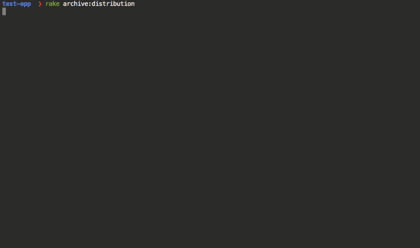

[](https://travis-ci.org/HipByte/motion-provisioning)

# motion-provisioning

Simplified provisioning for RubyMotion iOS, tvOS and macOS apps.

Getting started with iOS development has a very high barrier. Just
getting a app and device registered requires you to go through a *very*
complex web interface at developer.apple.com

motion-provisioning significantly alleviates the pain of these steps.

By providing your developer account, motion-provisioning automatically performs
the following tasks in the Developer Portal for you:

- Creates an application matching your app's name and bundle
  identifier.
- Creates development and distribution certificates.
- Creates development, distribution and adhoc profiles.
- Registers iOS devices.

For more awesomeness, use motion-provisioning along with [motion-appstore](https://github.com/HipByte/motion-appstore)!



## Installation

Add this line to your application's Gemfile:

```ruby
gem 'motion-provisioning'
```

And then execute:

    $ bundle

## Configuration

MotionProvisioning provides two handy methods. Pass them to the
`app.codesign_certificate` and `app.provisioning_profile` options in
the Rakefile.

```ruby
MotionProvisioning.certificate(platform: platform,
                               type: type
                               free: free)
```

|Parameter|Description|
|---------|------|
|`platform`|`:ios`, `:tvos`, `:mac`|
|`type`|`:beta`, `:distribution`, `:developer_id` (only mac)|
|`free`|`true` if you want to use a free developer account. Default: `false`|

```ruby
MotionProvisioning.profile(bundle_identifier: bundle_identifier,
                           app_name: app_name,
                           platform: platform,
                           type: type
                           free: free)
```

|Parameter|Description|
|---------|------|
|`bundle_identifier`|Pass `app.identifier`|
|`app_name`|Pass `app.name`|
|`platform`|`:ios`, `:tvos`, `:mac`|
|`type`|`:development`, `:distribution`, `:adhoc` (only iOS and tvOS), `:developer_id` (only mac)|
|`free`|`true` if you want to use a free developer account. Default: `false`|


Here's how you would configure an iOS app:

```ruby
Motion::Project::App.setup do |app|
  app.name = 'My App'
  app.identifier = 'com.example.myapp'

  app.development do
    app.codesign_certificate = MotionProvisioning.certificate(
      type: :development,
      platform: :ios)

    app.provisioning_profile = MotionProvisioning.profile(
      bundle_identifier: app.identifier,
      app_name: app.name,
      platform: :ios,
      type: :development)
  end

  app.release do
    app.codesign_certificate = MotionProvisioning.certificate(
      type: :distribution,
      platform: :ios)

    app.provisioning_profile = MotionProvisioning.profile(
      bundle_identifier: app.identifier,
      app_name: app.name,
      platform: :ios,
      type: :distribution)
  end
end
```

The certificates and profiles will be created and downloaded into a
`provisioning` folder in the root of your application folder as part of running
`rake archive:distribution` or `rake device`.

The output path can be configured by setting `MotionProvisioning.output_path`:

```ruby
MotionProvisioning.output_path = '../my_provisioning'
```

## Developer account

The first time you run MotionProvisioning, you will be asked for your Apple ID
email. It will optionally be stored in a YAML config file in
`provisioning/config.yaml`.

You will then be asked for your password, which will be stored securely in the Keychain.

If your account belongs to multiple developer teams, you will be asked to select
the one you want to use. It will also optionally be stored in the config file.

If there are multiple team members, it's very important each team member uses a
different account. Read "Sharing cerfiticates" below to know more.

The config file will look like this:

```yaml
email: foo@example.com
team_id: 5GU5F4
```

Alternatively, you can provide all this information via environment variables:

    MOTION_PROVISIONING_TEAM_ID
    MOTION_PROVISIONING_EMAIL
    MOTION_PROVISIONING_PASSWORD


## Free developer account

If you dont have a paid Apple developer account, set the `free:`
option to `true` and a free development certificate  and development
profile, valid to deploy to your device, will be created. You still
need a paid account to submit an app to the AppStore.

You can register a free developer account in
[developer.apple.com](https://developer.apple.com)

## Sharing certificates

Apple imposes restrictions in the number of certificates you can
create:

- One development certificate per team member.
- One distribution certificate per team.

The distribution certificate (and it's corresponding private key) must
be shared between all team members who will be creating distribution
builds.

motion-provisioning will ask before revoking the existing distribution
certificate and creating a new one.

After you create a new distribution certificate, share the
corresponding `.cer` and `.p12` files located in the `provisioning`
folder with your team members.

## Recreate certificates and profiles

Once the certificates and profiles are cached in the `provisioning`
folder, if you want to re-create them, set the `recreate_profile` or
`recreate_certificate` env variable.

For example, to recreate the development profile:

    rake device recreate_profile=1

Or to recreate the development certificate:

    rake device recreate_certificate=1

Or to recreate the distribution certificate:

    rake archive:distribution recreate_certificate=1

## Entitlements and App Services

motion-provisioning does not (yet) manage entitlements and app services (like
HealthKit, HomeKit or iCloud). To enable them, you need to go to the Developer
Portal. Then, recreate your provisioning profile and add the appropriate
entitlements to the `app.entitlements` hash in your Rakefile.

## Devices

If there are any iOS devices connected to the computer, and they are not
included in the provisioning profile, you will be asked to
register them in the Developer Portal and include them in the profile.

You can also add arbitrary device IDs by running:

    rake "motion-provisioning:add-device[device_name,device_id]"

Then, you will need to recreate the profile to include the newly registered device:

    rake device recreate_profile=1

## Testing

Run:

    bin/setup
    rspec

To generate profiling information:

    SPEC_PROFILE=1 rspec

To generate coverage information:

    SPEC_COVERAGE=1 rspec
